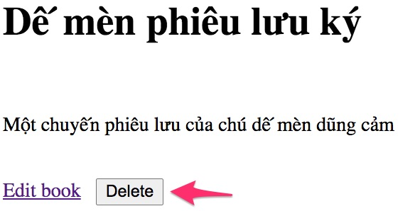

## Cấu trúc thư mục
```
.
├── java
│   ├── vn
│   │   ├── techmaster
│   │   │   ├── bookstore
│   │   │   │   ├── config
│   │   │   │   │   └── RepoConfig.java
│   │   │   │   ├── controller
│   │   │   │   │   └── BookController.java <-- Thay phương thức GET /book/delete/{id} bằng POST
│   │   │   │   ├── model
│   │   │   │   │   └── Book.java
│   │   │   │   ├── repository
│   │   │   │   │   ├── BookDao.java
│   │   │   │   │   └── Dao.java
│   │   │   │   ├── request
│   │   │   │   │   └── DeleteRequest.java <-- dùng để binding dữ liệu trong Request.Body
│   │   │   │   └── BookstoreApplication.java
├── resources
│   ├── static
│   │   └── book.csv
│   ├── templates
│   │   ├── allbooks.html
│   │   ├── book.html <-- Sửa link GET /book/delete/id thành button trong form POST /book/delete
│   │   └── form.html
│   └── application.properties
```

## Thực hành từng bước

1. Trong [book.html](src/main/resources/templates/book.html), sửa
```html
  <h1 th:text="${book.title}"></h1><br>
  <p th:text="${book.description}"></p><br>
  <a th:href="@{/book/edit/{id}(id=${book.id})}">Edit book</a>&nbsp;&nbsp;
  <a th:href="@{/book/delete/{id}(id=${book.id})}">Delete book</a><br>
```
thành

```html
  <form action="#" th:action="@{/book/delete}" th:object="${book}" method="post" novalidate="novalidate">
    <input type="hidden" th:field="*{id}"/>
    <h1 th:text="${book.title}"></h1><br>
    <p th:text="${book.description}"></p><br>
    <a th:href="@{/book/edit/{id}(id=${book.id})}">Edit book</a>&nbsp;&nbsp;
    <button type="submit">Delete</button>
  </form>
```

Chú ý ```<form action="#" th:action="@{/book/delete}" th:object="${book}" method="post"``` được thêm.

Có thêm một trường ẩn ```<input type="hidden" th:field="*{id}"/>```. Khi post lên /book/delete, trường id
sẽ dùng để tìm kiếm đầu sách để xoá.



2. Tạo class [DeleteRequest.java](src/main/java/vn/techmaster/bookstore/request/DeleteRequest.java)

```java
public class DeleteRequest {
  private int id;

  public int getId() {
    return id;
  }

  public void setId(int id) {
    this.id = id;
  }
  
}
```
Class này chỉ có duy nhất một thuộc tính id

3. Trong [BookController.java](src/main/java/vn/techmaster/bookstore/controller/BookController.java), bỏ phương thức
```java
@GetMapping(value = "/delete/{id}")
public String deleteByID(@PathVariable("id") int id) {    
  bookDao.deleteByID(id);        
  return "redirect:/book";
}
```

Thêm phương thức POST
```java
@PostMapping(value = "/delete")
public String deleteByID(@ModelAttribute DeleteRequest request, BindingResult result) {
  if (!result.hasErrors()) {
    bookDao.deleteByID(request.getId());
  }            
  return "redirect:/book";
}
```

4. Chạy lại để kiểm tra chức năng Delete


